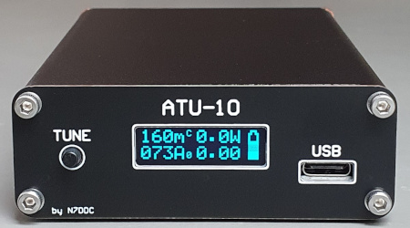

# ATU-10-BT: ATU-10 with Bluetooth Interface for Icom IC-705

This project adds Bluetooth interface to the ATU-10 for use with the Icom IC-705 transceiver. The code is based on ATU-10 FW version 1.6 and is ported from microC to the free MPLAB XC8 compiler. When not connected via Bluetooth to IC-705, the Tuner will mainly operate as with the original FW 1.6.

Main New Features:
- Bluetooth interface for connection to the IC-705 transceiver:
  - Receive frequency/band and SWR information from the transceiver.
  - Save and restore relay settings for each band.
  - Update the Tuner SWR reading to match the transceiver SWR reading.
  - Optionally add a HF-VHF/UHF antenna switch and additional BNC connector.
- Show current relay setting and band on the OLED display.
- Extensive OLED Settings menu for Cell Parameters, BT unpair, relay testing and more.
- Slightly more persistent tuning algorithm that may tune some previously difficult antennas.

Background:\
After testing the Icom AH-705, the mAT-705 and ATU-10 tuners it appeared that all had less than desired integration level with the transceiver, i.e. they all actually needed RF transmission in order to set the relays for previously tuned bands. A Bluetooth interface for the ATU-10 then seemed like a reasonable solution - and a reasonable sized project since it was all open source.

For more information, see the README files for each part of the project.
#
The ATU-10 by N7DDC main project can be found here:\
[https://github.com/Dfinitski/ATU-10-10W-QRP-antenna-tuner](https://github.com/Dfinitski/ATU-10-10W-QRP-antenna-tuner)
